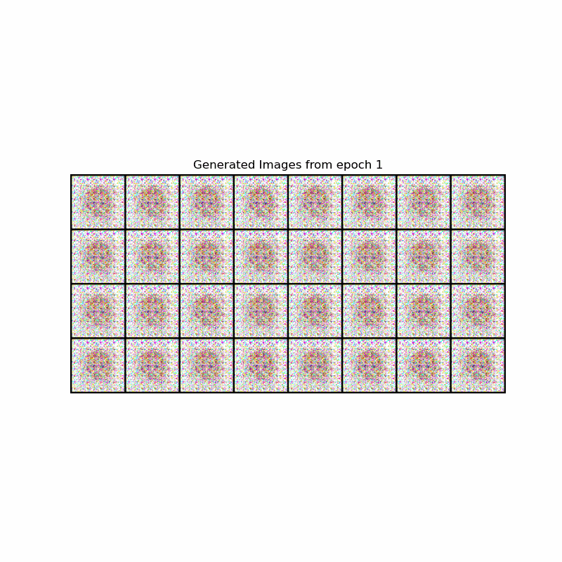
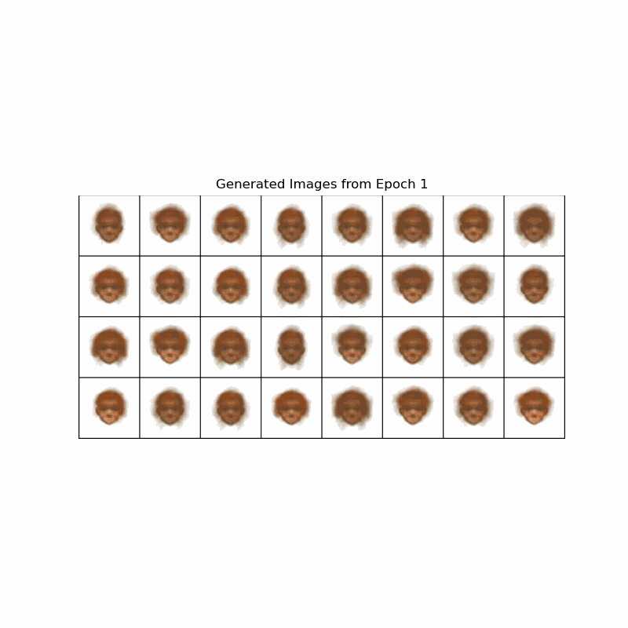

# GAN_Proj

Final Project, where we used a VAE and GAN to generate cartoon images.

## VAE

[VAE Training Script](APS360Project_Group61CartoonVAE.ipynb)

These are the images generated by the VAE across the 35 epochs:

## GAN

[VAE Training Script](APS360Project_Group61CartoonVAE.ipynb)

These are the images generated by the GAN across the 10 epochs:

