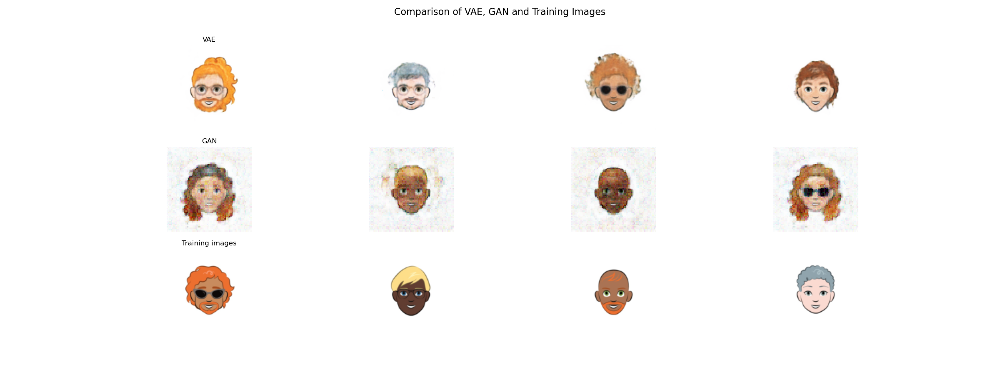

# Cartoon_Gen

Final Project, where we used a VAE (and a GAN as a baseline) to generate cartoon images.

This figure shows a comparison of images generated by the VAE and the GAN, as well as the original images:

## VAE

[VAE Training Script](APS360Project_Group61CartoonVAE.ipynb)

These are the images generated by the VAE across the 35 epochs:

## Baseline - GAN

[GAN Training Script](APS360Project_Group61CartoonBaseline.ipynb)

These are the images generated by the GAN across the 10 epochs:

